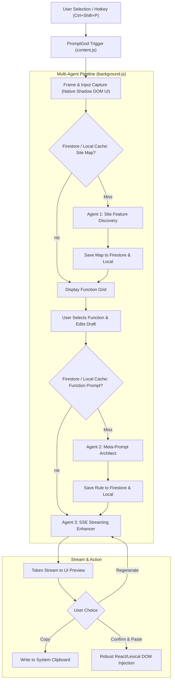

# ⚡ PromptGod

> **Supercharge, Enhance, and Deploy AI Prompts in Real-Time Across Any Generative AI Platform.**

PromptGod is a next-generation, agentic Chrome Extension (Manifest V3) engineered to elevate prompt crafting directly inside any web app. By combining multi-agent LLM reasoning, real-time Server-Sent Events (SSE) streaming, dual-layer cloud/local caching, and robust React/Lexical DOM insertion, PromptGod transforms rough, casual thoughts into precision-engineered, production-grade AI prompts without ever leaving your workflow.

---

## 🌟 Key Features

- **Autonomous 3-Tier Multi-Agent System:**
  - **Agent 1 (Site Mapper):** Scans the active web page and discovers all available AI generative capabilities (e.g. Text-to-Image, Code Generation, Copywriting, Video Prompting).
  - **Agent 2 (Meta-Prompt Architect):** Generates specialized system prompts and keyword rules tailored specifically to the target platform and generative function.
  - **Agent 3 (Real-Time Enhancer):** Streams detailed, high-fidelity prompt expansions directly to your screen using Server-Sent Events (SSE).
- **Dual-Layer Cloud & Local Caching:**
  - **Cloud (Google Firestore REST API):** Global crowd-sourced cache for site maps and function prompts. If a site or feature has already been mapped by any user, Agents 1 and 2 are skipped, resulting in near-instant prompt generation.
  - **Local (Chrome Storage):** Instant zero-latency local fallback cache.
- **Multi-Provider & Cutting-Edge Model Support:**
  - **Google AI Studio:** `gemma-4-31b-it`, `gemma-4-26b-a4b-it`, `gemini-2.5-flash-lite`, `gemini-3.5-flash-lite`, `gemini-3.1-flash-lite`, + Custom IDs.
  - **OpenRouter (Free & Paid Tier):** `nex-agi/nex-n2.5-mini:free`, `liquid/lfm-2.5-2.6b:free`, `nvidia/nemotron-3-embed-1b:free`, `nvidia/nemotron-3-ultra-550b-a55b:free`, `google/gemma-4-26b-a4b-it:free`, `google/gemma-4-31b-it:free`, `nvidia/nemotron-3-super-120b-a12b:free`, + Custom IDs.
  - **Groq (Ultra-Fast Inference):** `openai/gpt-oss-20b`, `openai/gpt-oss-120b`, `llama-3.3-70b-versatile`, `llama-3.1-8b-instant`, `groq/compound-mini`, `groq/compound`, `qwen/qwen3.8-27b`, `qwen/qwen3.6-27b`, + Custom IDs.
- **True Glassmorphic Shadow DOM UI:**
  - Injected inside an isolated **Shadow Root**—100% immune to CSS pollution from host websites.
  - **Live Draft Area:** Inspect and fine-tune your captured prompt before triggering the enhancement.
  - **Streaming Preview:** Watch the AI stream words token-by-token.
  - **One-Click Actions:** Instant clipboard **Copy**, **Regenerate**, and **Confirm & Paste**.
- **Bulletproof React & Lexical DOM Insertion:**
  - Compatible with complex modern editors (WhatsApp Web, ChatGPT, Claude, Midjourney, Discord, Slack, etc.).
  - Uses native `InputEvent` dispatching and `document.execCommand('insertText')` to preserve React internal state, undo trees, and history without destructive DOM mutation.
- **Multi-Frame & Iframe Intelligence:**
  - Dynamically detects and tracks focused input frames across `all_frames` and iframe boundaries.

---

## 🏗️ Architecture Overview



---

## 📂 Repository Structure

```
PromptGod/
├── chrome-extension/
│   ├── manifest.json       # MV3 manifest with all_frames & scripting
│   ├── background.js       # Multi-agent orchestrator, SSE streaming, Firestore REST API
│   ├── content.js          # Shadow DOM injection, input focus tracking, robust insertion
│   ├── options.html        # Glassmorphic settings page
│   ├── options.js          # Provider & model configuration
│   ├── icons/              # 16px, 48px, 128px high-res icons
│   └── modal.*             # Standalone modal assets
├── backend/
│   ├── main.py             # Optional Python Flask microservice (Legacy / Cloud Run)
│   ├── Dockerfile          # Containerized backend deployment
│   ├── requirements.txt    # Python dependencies
│   ├── run.bat             # Windows runner
│   └── setup.bat           # Environment installer
├── web/                    # Landing page deployed on Cloudflare Pages
│   └── index.html          # Dynamic landing page showcasing features & architecture
└── README.md
```

---

## 🚀 Getting Started

### 1. Installation in Google Chrome

1. **Clone the repository:**
   ```bash
   git clone https://github.com/muzahirabbas/PromptGod.git
   cd PromptGod
   ```
2. Open Google Chrome and navigate to:
   ```
   chrome://extensions/
   ```
3. Enable **Developer mode** toggle in the upper right corner.
4. Click **Load unpacked** and select the `chrome-extension` folder inside this repository.
5. The PromptGod icon will appear in your Chrome toolbar. Pin it for quick access!

---

### 2. Configure Your AI Provider

1. Right-click the **PromptGod** extension icon and click **Options** (or click "Details" -> "Extension options").
2. Select your preferred AI Provider:
   - **Google AI Studio** *(Recommended for lightning-fast speeds)*: Paste your API key from [aistudio.google.com](https://aistudio.google.com).
   - **OpenRouter**: Paste your free/paid key from [openrouter.ai/keys](https://openrouter.ai/keys).
   - **Groq**: Paste your ultra-fast key from [console.groq.com/keys](https://console.groq.com/keys).
3. Select your model (e.g. `gemini-2.5-flash-lite`, `google/gemma-4-31b-it:free`, `llama-3.3-70b-versatile`, or choose **Custom Model...**).
4. Click **Save Settings**.

---

### 3. Usage Workflow

1. **Focus or Highlight:** Click inside any text box (e.g., ChatGPT, Midjourney, WhatsApp, Claude) or highlight an existing draft prompt.
2. **Invoke PromptGod:**
   - Press <kbd>Ctrl</kbd> + <kbd>Shift</kbd> + <kbd>P</kbd> (Mac: <kbd>Cmd</kbd> + <kbd>Shift</kbd> + <kbd>P</kbd>), OR
   - Right-click and choose **Enhance with PromptGod**, OR
   - Click the extension icon on your browser toolbar.
3. **Review Your Draft:** In the popup, your captured prompt is displayed in the **Your Draft Prompt** box. You can modify it or paste additional context.
4. **Choose Enhancement Mode:** Click one of the auto-detected functions (e.g. *Image Generation*, *Code Optimization*, *Story Narrative*).
5. **Stream & Confirm:**
   - Watch the AI stream the enhanced prompt token-by-token.
   - Click **Copy** to copy to clipboard, **Regenerate** for another take, or **Confirm & Paste** to inject the prompt directly into your target input!

---

## 🛡️ Security & Privacy

- **Direct Client-to-API Communication:** Your API keys are stored exclusively inside your browser's private `chrome.storage.sync` and sent directly to Google / OpenRouter / Groq. No private proxies or intermediary servers inspect your keys.
- **Isolated Shadow DOM:** PromptGod's UI exists within a closed Shadow DOM container, preventing host page scripts from reading or intercepting your workspace.
- **Zero Data Harvesting:** Prompts are processed strictly for real-time enhancement.

---

## 🤝 Contributing

Contributions, feature requests, and issues are always welcome!
Feel free to open an issue or submit a pull request on [GitHub](https://github.com/muzahirabbas/PromptGod).

---

## 📄 License

Distributed under the **MIT License**.
